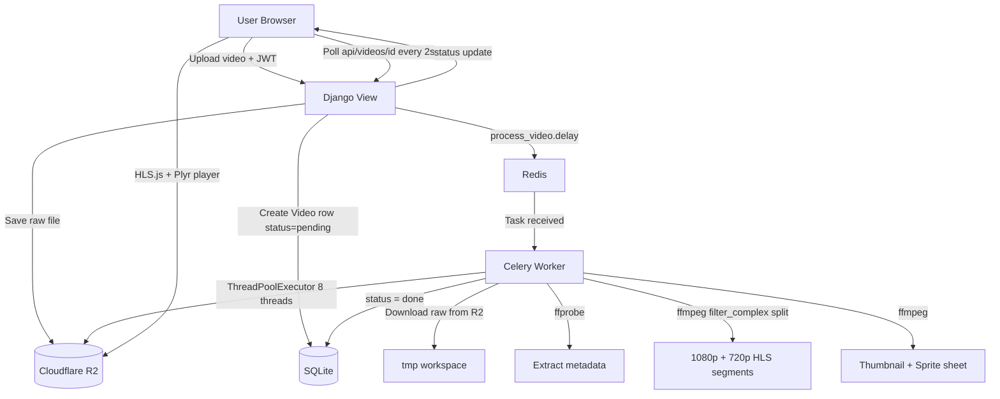

# StreamForge — Hugging Face Deployment Branch

## 🚀 Live Deployment: [senku1505-streamforge.hf.space](https://senku1505-streamforge.hf.space/)

> **Branch:** `deploy-huggingface` — production-ready Docker build targeting Hugging Face Spaces.
> For the base project, see the [`main` branch README](https://github.com/senku1505/StreamForge/blob/main/README.md).

---

## What is StreamForge?

StreamForge is a self-hosted video streaming platform built from scratch. You upload raw video files, and the platform automatically transcodes them into adaptive HLS streams (1080p + 720p), generates sprite sheets for seek previews, extracts metadata, and serves everything through a polished video player — all powered by FFmpeg running inside a Celery worker queue.

---

## ✨ Features

| Feature                          | Details                                                               |
| -------------------------------- | --------------------------------------------------------------------- |
| **Adaptive HLS Streaming** | Single-pass dual-encode to 1080p + 720p HLS with 6s segments          |
| **Sprite Sheet Previews**  | Hover the seek bar to see frame previews generated from the video     |
| **Concurrent Uploads**     | Drag-and-drop multi-file uploader with per-file real-time progress    |
| **JWT Authentication**     | Custom JWT auth, login persisted via`localStorage`                  |
| **My Studio**              | Per-user video management — rename, delete, and view your own videos |
| **Public Feed**            | All uploaded videos with R2 CDN-backed thumbnails and HLS playback    |
| **Rebuild Persistence**    | Videos + users auto-restored from R2 metadata on container restart    |
| **10-Day Auto-Cleanup**    | R2 storage and DB wiped automatically every 10 days                   |
| **Keep-Alive Cron**        | GitHub Actions pings the Space every 47.5 hours to prevent sleep      |

---

## 🏗️ Architecture

```
┌─────────────────────────────────────────────────────────────────┐
│                    Hugging Face Space (Docker)                   │
│                                                                  │
│  ┌──────────────┐   ┌──────────────┐   ┌──────────────────────┐ │
│  │   Gunicorn   │   │    Redis     │   │   Celery Worker      │ │
│  │  (3 workers) │   │  (in-proc)   │   │  (ForkPoolWorker)    │ │
│  │  port 7860   │   │  port 6379   │   │                      │ │
│  └──────┬───────┘   └──────┬───────┘   └──────────┬───────────┘ │
│         │                  │                       │             │
│         │    Django REST   │   Task Queue          │             │
│         └──────────────────┼───────────────────────┘             │
│                            │                                     │
│              SQLite DB (ephemeral, rebuilt on restart)           │
└────────────────────────────┼────────────────────────────────────┘
                             │
               ┌─────────────▼──────────────┐
               │   Cloudflare R2 Bucket      │
               │   (streamforge-media)        │
               │                              │
               │  raw/          ← source mp4  │
               │  hls/<id>/     ← HLS streams │
               │  thumbnails/   ← JPG thumbs  │
               │  sprites/      ← sprite JPGs │
               │  hls/<id>/metadata.json      │
               │  cleanup_metadata.json        │
               └──────────────────────────────┘
```

### Request → Playback Flow



---


## 🛠️ Tech Stack

| Layer                      | Technology                                                          |
| -------------------------- | ------------------------------------------------------------------- |
| **Backend**          | Django 4.x, Django REST Framework                                   |
| **Auth**             | Custom JWT (PyJWT, 7-day tokens)                                    |
| **Task Queue**       | Celery 5.x + Redis (in-process, no external broker)                 |
| **Video Processing** | FFmpeg + FFprobe (`libx264`, `aac`, HLS muxer)                  |
| **Object Storage**   | Cloudflare R2 (S3-compatible) via`django-storages` + `boto3`    |
| **Database**         | SQLite (ephemeral, rebuilt from R2 on each restart)                 |
| **Frontend**         | Vanilla HTML/CSS/JS, Tailwind CDN, Plyr player, HLS.js              |
| **Container**        | Docker (`python:3.9-slim`), runs as `user 1000` (HF compatible) |
| **CI / Keep-Alive**  | GitHub Actions workflow pings HF Space every 47.5h                  |

---

## 📂 R2 Bucket Structure

```
streamforge-media/
├── raw/
│   └── <original_filename>.mp4          ← uploaded source file
├── hls/
│   └── <video_id>/
│       ├── master.m3u8                  ← multi-bitrate playlist
│       ├── 1080p/
│       │   ├── stream.m3u8
│       │   └── seg000.ts … segN.ts
│       ├── 720p/
│       │   ├── stream.m3u8
│       │   └── seg000.ts … segN.ts
│       └── metadata.json                ← title, owner, duration, fps,
│                                           codec, resolution, bitrate,
│                                           owner_password_hash
├── thumbnails/
│   └── <video_id>.jpg
├── sprites/
│   └── <video_id>.jpg                   ← sprite sheet for seek preview
└── cleanup_metadata.json                ← stores last_cleanup timestamp
```

---

## ♻️ Rebuild Persistence

Because Hugging Face Spaces uses an **ephemeral container** (SQLite is wiped on every rebuild), StreamForge recovers state on every boot via `start.sh`:

```
1. python manage.py migrate          → create fresh DB schema
2. python manage.py sync_s3          → scan R2 for hls/*/metadata.json
                                        → restore Video rows
                                        → restore User accounts
                                           (password hash saved in metadata.json)
3. createsuperuser (if env vars set) → admin access
4. celery worker + gunicorn          → serve
```

Users are restored with their **exact password hash** (stored in `metadata.json` in R2 when a video is first processed). No data is lost across rebuilds — only the ephemeral SQLite is regenerated.

---

## 🔐 Environment Variables (Hugging Face Secrets)

| Variable                      | Purpose                                                          |
| ----------------------------- | ---------------------------------------------------------------- |
| `AWS_ACCESS_KEY_ID`         | R2 access key                                                    |
| `AWS_SECRET_ACCESS_KEY`     | R2 secret key                                                    |
| `AWS_S3_ENDPOINT_URL`       | R2 endpoint (e.g.`https://<account>.r2.cloudflarestorage.com`) |
| `AWS_STORAGE_BUCKET_NAME`   | R2 bucket name                                                   |
| `DJANGO_SECRET_KEY`         | Django secret key                                                |
| `DJANGO_SUPERUSER_USERNAME` | Auto-created admin username on first boot                        |
| `DJANGO_SUPERUSER_PASSWORD` | Admin password (also used as fallback for restored users)        |
| `DJANGO_SUPERUSER_EMAIL`    | Admin email                                                      |
| `WIPE_STORAGE`              | Set to`True` to wipe all R2 + DB on next restart               |

---

## 📦 Deployment Notes

### FFmpeg Single-Pass Dual Encode

Both 1080p and 720p HLS streams are generated in **a single FFmpeg invocation** using `filter_complex split`, cutting encode time by ~50%:

```bash
ffmpeg -i input.mp4 \
  -filter_complex '[0:v]split[v1][v2];[v1]scale=...:1080[out1080];[v2]scale=...:720[out720]' \
  -map [out1080] -map 0:a:0? ... 1080p/stream.m3u8 \
  -map [out720]  -map 0:a:0? ... 720p/stream.m3u8
```

> `-map 0:a:0?` maps only the **first audio track** — critical for iPhone/iOS videos which embed extra `Core Media Metadata` data streams with `codec: none` that would crash FFmpeg otherwise.

### Parallel S3 Uploads

After transcoding, all assets (HLS segments, thumbnail, sprite, metadata JSON) are uploaded to R2 **concurrently** using `ThreadPoolExecutor(max_workers=8)`.

---

## 🔄 Auto-Cleanup

- **Every 10 days**: R2 bucket and SQLite are automatically wiped (controlled by `cleanup_metadata.json` in R2)
- **Manual wipe**: Set `WIPE_STORAGE=True` in HF Space secrets and restart

---

## 🛜 Keep-Alive

A GitHub Actions workflow (`.github/workflows/keep_alive.yml`) pings the HF Space URL every **47.5 hours** to prevent the Space from going to sleep due to inactivity.

---

## 📡 API Endpoints

| Method     | Endpoint                  | Auth        | Description                        |
| ---------- | ------------------------- | ----------- | ---------------------------------- |
| `POST`   | `/api/login/`           | None        | Login, returns JWT token           |
| `POST`   | `/api/videos/`          | JWT         | Upload video, triggers Celery task |
| `GET`    | `/api/videos/`          | None        | List all public videos             |
| `GET`    | `/api/videos/<id>/`     | None        | Get single video status + metadata |
| `DELETE` | `/api/videos/<id>/`     | JWT (owner) | Delete video + R2 assets           |
| `PATCH`  | `/api/videos/<id>/`     | JWT (owner) | Rename video                       |
| `GET`    | `/api/videos/personal/` | JWT         | List current user's videos         |

---

## 📄 License

MIT

### equest → Playback Flow

```mermaid
graph TD
    U[User Browser] -->|POST /api/videos/ + JWT| DJ[Django View]
    DJ -->|Save raw file| R2[(Cloudflare R2)]
    DJ -->|Create Video DB row status=pending| DB[(SQLite)]
    DJ -->|process_video.delay| RD[Redis]

    RD -->|Task received| CW[Celery Worker]
    CW -->|Download raw from R2| TMP[/tmp workspace]
    CW -->|ffprobe| META[Extract metadata]
    CW -->|ffmpeg filter_complex split| HLS[1080p + 720p HLS]
    CW -->|ffmpeg| THUMB[Thumbnail + Sprite]
    CW -->|ThreadPoolExecutor x8| R2
    CW -->|status=done| DB

    U -->|Poll /api/videos/id/ every 2s| DJ
    DJ -->|status update| U
    U -->|HLS.js + Plyr player| R2
```

### equest → Playback Flow

```mermaid
graph TD
    U[User Browser] -->|POST /api/videos/ + JWT| DJ[Django View]
    DJ -->|Save raw file| R2[(Cloudflare R2)]
    DJ -->|Create Video DB row status=pending| DB[(SQLite)]
    DJ -->|process_video.delay| RD[Redis]

    RD -->|Task received| CW[Celery Worker]
    CW -->|Download raw from R2| TMP[/tmp workspace]
    CW -->|ffprobe| META[Extract metadata]
    CW -->|ffmpeg filter_complex split| HLS[1080p + 720p HLS]
    CW -->|ffmpeg| THUMB[Thumbnail + Sprite]
    CW -->|ThreadPoolExecutor x8| R2
    CW -->|status=done| DB

    U -->|Poll /api/videos/id/ every 2s| DJ
    DJ -->|status update| U
    U -->|HLS.js + Plyr player| R2
```

### equest → Playback Flow

```mermaid
graph TD
    U[User Browser] -->|POST /api/videos/ + JWT| DJ[Django View]
    DJ -->|Save raw file| R2[(Cloudflare R2)]
    DJ -->|Create Video DB row status=pending| DB[(SQLite)]
    DJ -->|process_video.delay| RD[Redis]

    RD -->|Task received| CW[Celery Worker]
    CW -->|Download raw from R2| TMP[/tmp workspace]
    CW -->|ffprobe| META[Extract metadata]
    CW -->|ffmpeg filter_complex split| HLS[1080p + 720p HLS]
    CW -->|ffmpeg| THUMB[Thumbnail + Sprite]
    CW -->|ThreadPoolExecutor x8| R2
    CW -->|status=done| DB

    U -->|Poll /api/videos/id/ every 2s| DJ
    DJ -->|status update| U
    U -->|HLS.js + Plyr player| R2
```
