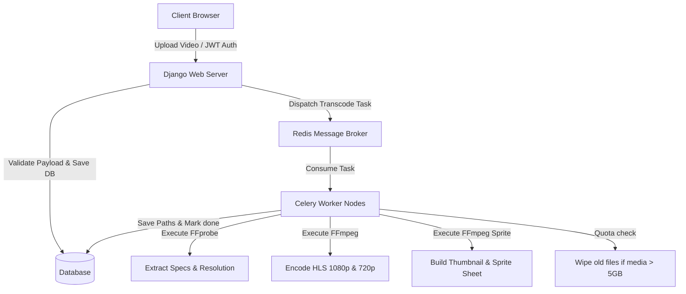

# StreamForge (Hugging Face Deployment Branch)

## Deployed Project: [StreamForge on Hugging Face Spaces](https://senku1505-streamforge.hf.space/)

For the original project details, see the [Main README on GitHub](https://github.com/senku1505/StreamForge/blob/main/README.md).

---


## Project Features

- **Adaptive HLS Streaming:** Automatically segments uploads into 6-second fragments and compiles multi-bitrate playlists (1080p and 720p).
- **Concurrent Upload Dashboard:** Drag-and-drop file uploader supporting simultaneous uploads and real-time processing stage indicators.
- **JWT Authentication Backend:** Secure custom authentication using JSON Web Tokens.
- **Public Feed & Personal Page Isolation:** Multi-user feeds showing uploader credits, with delete authorizations restricted to owner accounts.
- **Sprite Sheet Hover Previews:** Fast seek bar previews and library thumbnails animated with CSS background shifts on sprite sheets.
- **Detailed Metadata Side Panel:** Side panel rendering code specifications, frame rates (FPS), bitrates, resolution, and formats.
- **Storage Limit Manager:** Auto-deletes the oldest 2 videos when the media directory exceeds a 5 GB disk quota.

---

## Tech Stack Used

- **Backend:** Django, Django REST Framework (DRF)
- **Database:** SQLite (Development), PostgreSQL/RDS (Production)
- **Distributed Worker Queue:** Celery, Redis
- **Processing Engine:** FFmpeg, FFprobe
- **Frontend:** HTML5, CSS3, Tailwind CSS, Javascript, Plyr (Player engine)
- **Containerization:** Docker, Docker Compose

---

## Simple Project Workflow



---

## Running with Docker Compose

Running the entire containerized stack (Django, Redis, and Celery workers) is fully automated:

```bash
docker-compose up --build
```

This single command handles:

1. Building Python-slim images loaded with FFmpeg dependencies.
2. Launching Redis queue containers.
3. Automatically applying database schema migrations.
4. Starting both the Celery processing daemon and the Django app server.

Open your browser to `http://localhost:8000/` once the console indicates the servers have booted.

---

## Local Development Installation

### Prerequisites

Ensure the following tools are installed on your local operating system:

- Python 3.9+
- Redis Server
- FFmpeg (includes FFprobe)

### 1. Configure the Environment

Clone the repository and create a virtual environment:

```bash
git clone https://github.com/senku1505/StreamForge.git
cd StreamForge
python3 -m venv venv
source venv/bin/activate
```

### 2. Install Python Dependencies

Install the required packages from requirements.txt:

```bash
pip install -r requirements.txt
```

### 3. Initialize the Database

Generate database tables and apply schema migrations:

```bash
python manage.py makemigrations
python manage.py migrate
```

### 4. Start the Application Stack

Start the Redis server:

```bash
redis-server
```

Start the Celery worker nodes (open a new terminal window):

```bash
celery -A streamforge worker --loglevel=info
```

Start the Django development server:

```bash
python manage.py runserver
```

Open your browser and navigate to `http://127.0.0.1:8000/` to test.

### 5. Admin Panel & Superuser

To manage users and access the Django admin panel, you will need to create a superuser account. Run the following command in your terminal (with your virtual environment activated):

```bash
python manage.py createsuperuser
```

Follow the prompts to set your username, email, and password. Once created, you can access the admin panel by navigating to `http://127.0.0.1:8000/admin/` in your browser and logging in with those credentials.
